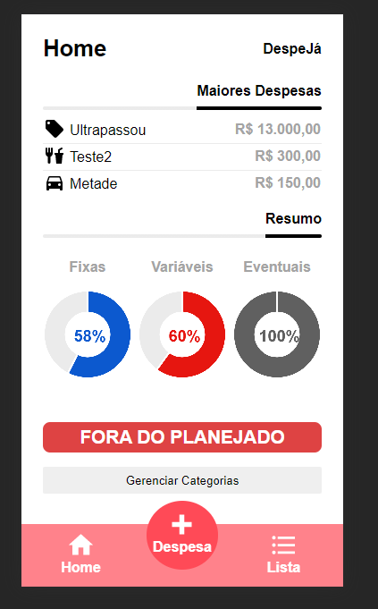
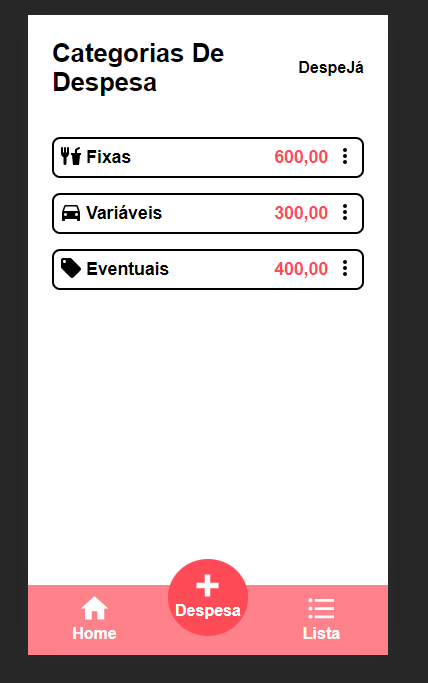
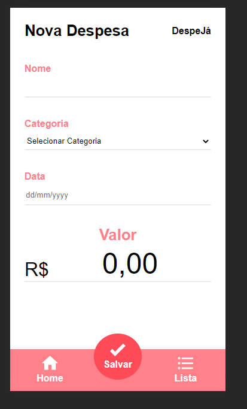
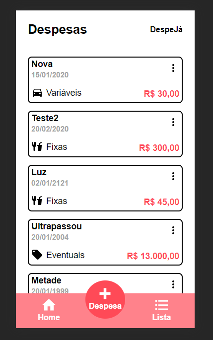

#DespeJá

###Por: Arthur Henrique Machado Fernandes

---
O **DespeJá** é uma aplicação de gestão de despesas, nela você pode inserir
e gerenciar suas despesas em tres tipos de categorias: Fixas, variáveis e
eventuais. Sendo possível definir orçamentos para cada categoria e se 
manter dentro de seu orçamento.

---
####Dependências

A aplicação utiliza:

* [ChartJs](https://www.chartjs.org/): Para renderização dos gráficos.
* [SweetAlert2](https://sweetalert2.github.io/): Para exibição de dialogos.
* [Maska](https://github.com/beholdr/maska): Para aplicação de mascaras de data.
* [Simple Mask Money](https://github.com/codermarcos/simple-mask-money): Para aplicação de mascara de valor monetário.

---
###Telas

####Home

A Home é onde fica os resumos, aqui demostra o quanto ja gastou e o que restou de 
seu orçamento assim como um link para a tela de gerenciamento de categorias.
Por fim ela mostra as tres maiores despesas cadastradas.

####Gerenciamento de Categoria

A tela de gerenciamento de categoria é o lugar para você definir o
limite de cada categoria 

####Nova Despesa

Na tela de nova despesa é possível inserir suas despesas na aplicação
aqui devera fornecer o nome para despesa, sua categoria, data que foi
realizada e seu valor.

####Despesas

Na tela de despesas esta uma listagem de todas as despesas cadastradas
sendo possível através do menu tres pontos deletar ou editar uma despesa
ja cadastrada.

----

###Dados

Os dados que a aplicação armazena são os dados respectivos a cada 
despesa como seu nome para identificação, data facilitar a verificação
em conjunto com faturas e etc, tipo de categoria para realizar os 
relatórios e o valor para a mesma finalidade do tipo.

---

###Questionário

####A aplicação é original e não uma cópia da aplicação de um colega ou de uma aplicação já existente?
Sim, é original.
####A aplicação tem pelo menos duas interfaces (telas ou páginas) independentes?
Sim: Home, Gerenciamento de Categoria, Nova Despesa e Despesas.
####A aplicação armazena e usa de forma relevante dados complexos do usuário?
Sim, os dados de cada despesa que ele inserir.
####A aplicação possui um manifesto para instalação no dispositivo do usuário?
Sim
####A aplicação possui um service worker que permite o funcionamento off-line?
Sim
####O código da minha aplicação possui comentários explicando cada operação?
Sim
####A aplicação está funcionando corretamente?
Sim
####A aplicação está completa?
Sim

